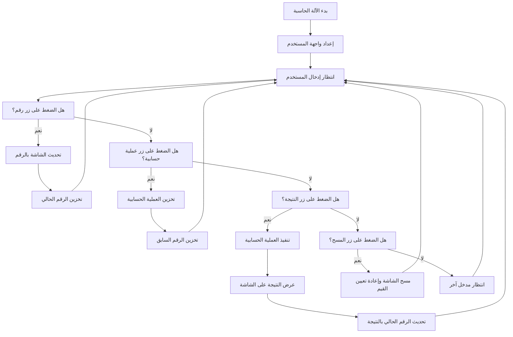

 <!-- eslint-disable  -->

```mermaid
flowchart TB
    A[بدء الآلة الحاسبة] --> B[إعداد واجهة المستخدم]
    B --> C[انتظار إدخال المستخدم]
    C --> D[هل الضغط على زر رقم؟]
    D -- نعم --> E[تحديث الشاشة بالرقم]
    E --> F[تخزين الرقم الحالي]
    F --> C
    D -- لا --> G[هل الضغط على زر عملية حسابية؟]
    G -- نعم --> H[تخزين العملية الحسابية]
    H --> I[تخزين الرقم السابق]
    I --> C
    G -- لا --> J[هل الضغط على زر النتيجة؟]
    J -- نعم --> K[تنفيذ العملية الحسابية]
    K --> L[عرض النتيجة على الشاشة]
    L --> M[تحديث الرقم الحالي بالنتيجة]
    M --> C
    J -- لا --> N[هل الضغط على زر المسح؟]
    N -- نعم --> O[مسح الشاشة وإعادة تعيين القيم]
    O --> C
    N -- لا --> P[انتظار مدخل آخر]
    P --> C


```
